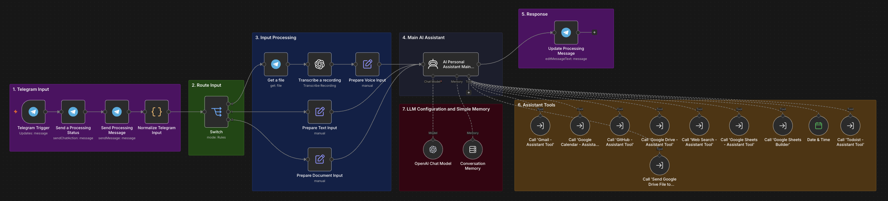
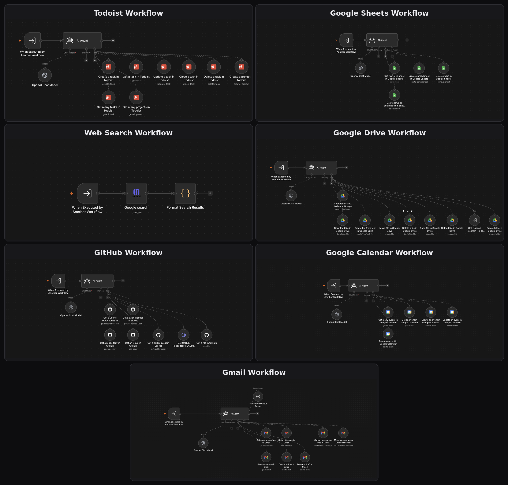

# Personal AI Assistant - n8n

A modular personal AI assistant built with **n8n**, **OpenAI**, **Telegram**, and a collection of specialized tool workflows.

The goal of this project is to turn n8n into a personal "command center": instead of opening several applications separately, I can interact with one AI assistant through Telegram and ask it to search information, manage email, create calendar events, work with files and spreadsheets, manage Todoist tasks, inspect GitHub repositories, and handle voice messages. Like a real AI Personal Assistant.

## Overview

The project started as a practical exploration of AI agents, tool calling, voice workflows, and automation with n8n while studying AI automation and agent development. It has since evolved into a more modular personal assistant architecture, where the main AI agent acts as an orchestrator and delegates specialized operations to independent sub-workflows.

The diagram below shows the **main workflow** architecture and how Telegram input flows through the AI assistant and its specialized tools.



This architecture keeps the main agent focused on **understanding the user's intent and choosing the right tool**, while each specialized workflow is responsible for the details of one integration.

## Core Features

### Telegram Interface 💬

Telegram is the primary user interface.

The workflow supports:

- Text messages
- Voice messages
- Document uploads
- Processing feedback while the assistant is working
- Dynamic session memory based on the Telegram chat
- Concise assistant responses

A typical request looks like:

```text
User
  ↓
"Create a Todoist task for tomorrow at 10"
  ↓
Telegram
  ↓
Main AI Agent
  ↓
Todoist Assistant Tool
  ↓
Todoist API
  ↓
Result
  ↓
Telegram response
```

---

### 🎙️ Voice Messages

Voice messages follow a separate path inside the Telegram workflow.

```text
Telegram voice message
        ↓
Get Telegram file
        ↓
OpenAI transcription
        ↓
Normalized text input
        ↓
Main AI Agent
```

The transcription is then treated as if it were the user's original text message.

The transcription workflow is configured for Portuguese input.

---

### 📄 Document Handling

The Telegram interface can also receive documents.

When a document is uploaded, the workflow keeps the relevant Telegram file metadata and passes the user's accompanying instruction to the main assistant.

For example:

```text
User:
[uploads a file]
"Save this to Google Drive"
```

Telegram documents can be handled by a dedicated Google Drive workflow for uploading files to Drive.

## AI Agent Architecture

The project uses a **main coordinator agent + specialized sub-agents/workflows** architecture.



This is one of the most important design decisions in the project.

Instead of creating one huge agent containing every integration detail, the project separates responsibilities:

```text
Main Agent
   │
   ├── Gmail Assistant
   ├── Google Calendar Assistant
   ├── Google Drive Assistant
   ├── Google Sheets Assistant
   ├── GitHub Assistant
   ├── Todoist Assistant
   ├── Web Search
   └── Date & Time
```

### Why this architecture?

It provides several advantages:

- Smaller and more focused prompts
- Easier debugging
- Easier testing
- Clear separation of responsibilities
- Easier replacement of individual integrations
- Reusable specialist workflows
- Better maintainability as the project grows

The main agent does not need to know how Gmail search works internally. It only needs to know **when Gmail should be used and what request should be passed to it**. The same for the other tools.

## Available Tools

The main assistant delegates specialized tasks to dedicated workflows:

- **Gmail Assistant** — Search, read, draft, send, reply to, and forward emails.
- **Google Calendar Assistant** — Search, create, update, and delete calendar events.
- **Google Drive Assistant** — Search, retrieve, upload, organize, copy, move, and delete files.
- **Google Sheets Assistant** — Create spreadsheets, read rows, delete rows, and manage sheets.
- **GitHub Assistant** — Inspect repositories, source files, README files, issues, and pull requests.
- **Todoist Assistant** — Create, search, update, complete, and delete tasks, as well as manage projects.
- **Web Search Assistant** — Retrieve current or external information from the web.
- **Date & Time Tool** — Resolve current and relative dates and times.

A dedicated **Google Drive → Telegram** workflow is also used to send selected Drive files back to the current Telegram chat.

Each workflow is responsible for its own domain logic, while the **main assistant coordinates the appropriate tool based on the user's request.**

# Memory

The main Telegram assistant currently uses a **windowed memory buffer**.

Current configuration:

```text
Session key:
Telegram chat ID

Context window:
10 messages
```

This means recent conversation context can be maintained between messages in the same Telegram session. It is intentionally a **short-term conversational memory**, not a permanent user profile.

### Current memory model

```text
Recent messages
      ↓
Simple Memory
      ↓
Main AI Agent
```

### Future memory direction

A future version can introduce long-term memory for persistent information such as:

- Preferences
- Important projects
- Repeated instructions
- Personal workflows
- Frequently used entities

The current implementation deliberately keeps memory simple.

---

# Telegram Processing Architecture

The current Telegram interface performs message routing before reaching the main agent.

```text
Telegram Trigger
      │
      ▼
Send "processing" feedback
      │
      ▼
Input Router
      │
      ├───────────────┐
      │               │
      ▼               ▼
     Text           Voice
      │               │
      │          Get Telegram file
      │               │
      │          OpenAI transcription
      │               │
      └───────┬───────┘
              │
              ▼
         Normalized input
              │
              ▼
       Main AI Assistant
              │
              ▼
       Selected tool
              │
              ▼
           Result
              │
              ▼
      Edit Telegram response
```

Documents have their own input path so that file metadata can be preserved and passed to the relevant tool.

The response handling was initially implemented by sending a new Telegram message after the agent completed its work. This was later changed to editing the existing "processing" message, allowing the bot to provide immediate feedback that the request is being processed and then update the same message with the final response.

---

# Tool Calling Strategy

The project uses **workflow-as-tool** patterns in n8n.

Conceptually:

```text
Main AI Agent
      │
      │ tool call
      ▼
Execute Workflow
      │
      ▼
Specialist AI Agent
      │
      ▼
Service-specific tools/API
```

For example:

```text
Main Agent
   ↓
Todoist Assistant Tool
   ↓
Todoist specialist agent
   ↓
Todoist tools
```

---

# Models

### Main Assistant

Current model:

```text
gpt-5.4-nano
```

Reasoning effort:

```text
low
```

Maximum main-agent iterations:

```text
4
```

### Specialist Workflows

Some specialist workflows currently use:

```text
gpt-5-mini
```

with low reasoning effort.

The model choices are intentionally kept relatively lightweight because the system is designed primarily as an orchestration and tool-use layer.

---

# Technology Stack

| Area                | Technology           |
| ------------------- | -------------------- |
| Automation          | n8n                  |
| AI orchestration    | n8n AI Agent         |
| Main LLM            | OpenAI               |
| Chat interface      | Telegram             |
| Voice transcription | OpenAI               |
| Email               | Gmail                |
| Calendar            | Google Calendar      |
| Files               | Google Drive         |
| Spreadsheets        | Google Sheets        |
| Task management     | Todoist              |
| Code repositories   | GitHub               |
| Web research        | Web Search workflow  |
| Date/time           | n8n Date & Time tool |
| Version control     | Git / GitHub         |

---

## Credentials

Credentials should remain inside **n8n's credential system.**

The repository should contain workflow configuration and logic, **not authentication secrets**.

---

## External Data

This assistant can potentially access:

- Email
- Calendar data
- Cloud files
- Spreadsheets
- GitHub repositories
- Todoist tasks

Because of that, integrations should follow least-privilege principles whenever possible.

Before connecting additional services, consider:

- Which data the workflow can access
- Which actions it can perform
- Whether write/delete permissions are actually necessary
- Whether sensitive content is being sent to an external model/provider
- How credentials are stored and rotated

---

# Importing the Workflows

The project is modular, so the main Telegram workflow depends on several specialist workflows.

A typical import sequence is:

```text
1. Gmail Assistant Tool
2. Google Calendar Assistant Tool
3. GitHub Assistant Tool
4. Google Drive Assistant Tool
5. Upload Telegram File to Google Drive
6. Send Google Drive File to Telegram
7. Google Sheets Assistant Tool
8. Google Sheets Builder
9. Todoist Assistant Tool
10. Web Search Assistant Tool
11. Main Telegram Assistant Interface
```

After importing:

1. Reconnect the required credentials.
2. Check that every workflow tool points to the correct specialist workflow.
3. Configure Telegram.
4. Configure webhook/public URL settings.
5. Test each specialist workflow independently.
6. Test the main Telegram assistant end-to-end.
7. Verify that all required workflows are **published** and active in n8n.

Public workflow exports are intentionally stripped of credentials and instance-specific secrets.

---

# Recommended Repository Structure

A clean project structure is:

```text
personal_ai_command_center/

│
├── workflows/
│   │
│   ├── telegram/
│   │   └── telegram_assistant_interface.json
│   │
│   ├── gmail/
│   │   └── gmail_assistant_tool.json
│   │
│   ├── calendar/
│   │   └── calendar_assistant_tool.json
│   │
│   ├── github/
│   │   └── github_assistant_tool.json
│   │
│   ├── google_drive/
│   │   ├── google_drive_assistant_tool.json
│   │   ├── upload_telegram_file_to_google_drive.json
│   │   └── send_google_drive_file_to_telegram.json
│   │
│   ├── google_sheets/
│   │   ├── google_sheets_assistant_tool.json
│   │   └── google_sheets_builder.json
│   │
│   ├── todoist/
│   │   └── todoist_assistant_tool.json
│   │
│   └── web_search/
│       └── web_search_assistant_tool.json
│
├── .gitignore
└── README.md
```

The exact filenames can differ, but the principle is to keep **the main interface and specialist integrations clearly separated**.

---

# Why n8n?

n8n works particularly well for this project because it combines:

- Visual workflow design
- API integrations
- Webhooks
- AI agents
- Tool calling
- Sub-workflows
- Credentials
- Code nodes
- External services
- Automation logic

The result is a system where the AI handles the **reasoning and routing**, while deterministic workflow nodes handle the **actual operations**.

That distinction is important.

---

# Learning Goals

This project is also a practical AI Engineering exercise.

It applies concepts including:

- LLM integration
- AI agents
- Agent orchestration
- Tool calling
- Sub-agents
- Workflow composition
- Prompt engineering
- Short-term memory
- Voice transcription
- API integration
- Webhooks
- Structured data handling
- Automation design
- Error handling
- Authentication and credentials
- Security considerations
- Deployment architecture
- Git/GitHub workflow

The project is therefore more than a collection of n8n workflows. It is an attempt to apply **AI Engineering concepts to a real personal automation system**.

---

# Repository

GitHub:

https://github.com/andref218/personal_ai_command_center

---

# Author

**André Fonseca**

- GitHub: https://github.com/andref218

---

## Final Note

This project is intentionally evolving.

The current implementation prioritizes learning, modularity, experimentation, and real-world usefulness. The architecture is designed to grow over time rather than trying to solve every possible assistant capability in a single workflow from day one.
